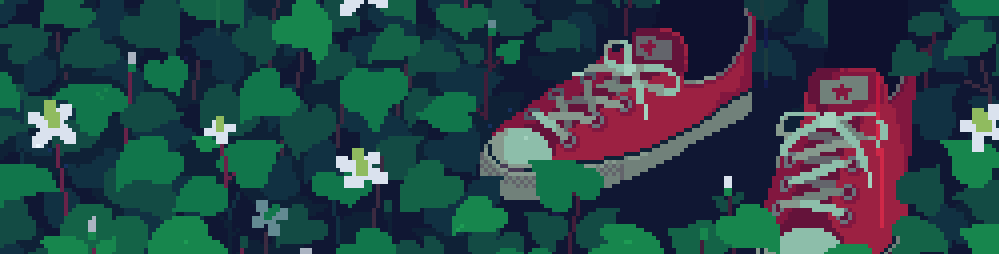

<h1 align="center">¡Hola! Soy Max 👾</h1>

  

  

---

  

### 👾 Sobre mí

- 🔭 Trabajando en proyectos de gestión empresarial con **React** y **PrimeReact**
- 🌱 Explorando mejores patrones de arquitectura frontend
- ⚡ Me gusta que el código sea limpio, tipado y bien estructurado
- 🌍 Lima, Perú
- 🗣 Español (nativo) · Inglés (intermedio)
- 📫 ¿Hablamos? Encuéntrame aquí en GitHub

---

  

### 🚀 Tecnologías que uso

  
  
  
  
  
  
  
  

---

### 📊 Mis estadísticas en GitHub

  

  

  

  

---

### 📈 Actividad

---

### 📬 Contacto

  
  

---

  

  

